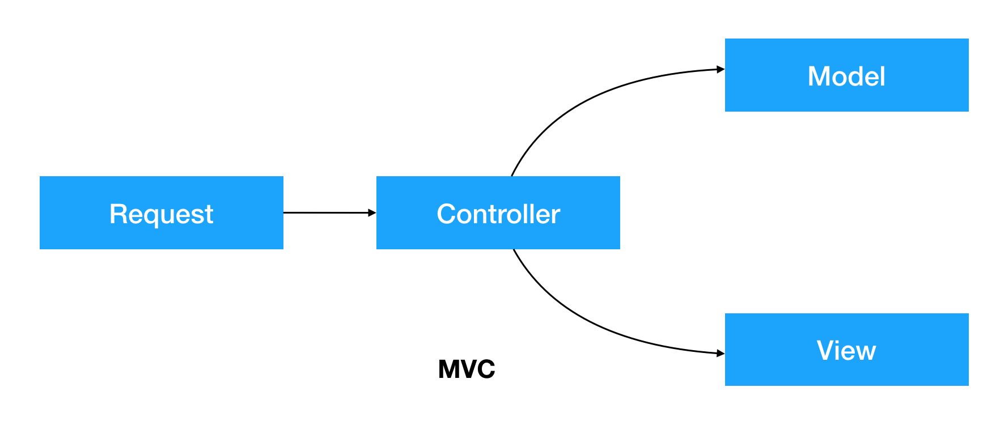

## 1. 组件通信

### 父组件与自组件通信

- 父组件将自己的状态传递给子组件，子组件当做属性来接收，当父组件更改自己状态的时候，子组件接收到的属性就会发生改变
- 父组件利用`ref`对子组件做标记，通过调用子组件的方法以更改子组件的状态,也可以调用子组件的方法

### 子组件与父组件通信

- 父组件将自己的某个方法传递给子组件，在方法里可以做任意操作，比如可以更改状态，子组件通过`this.props`接收到父组件的方法后调用。

### 跨组件通信

在react没有类似vue中的事件总线来解决这个问题，我们只能借助它们共同的父级组件来实现，将非父子关系装换成多维度的父子关系。react提供了`context` api来实现跨组件通信, React 16.3之后的`context`api较之前的好用。

### 练习

实例，使用`context` 实现购物车中的加减功能

> 复杂的非父子组件通信在react中很难处理，多组件间的数据共享也不好处理，在实际的工作中我们会使用flux、redux、mobx来实现

## 2. HOC(高阶组件)

> 高阶组件是一个函数接受一个组件作为参数，返回一个新的组件

```js
// index.js
import React, { Component } from "react";
import ReactDOM from "react-dom";
import newCompents from "./newCompents";
// 声明App组件作为参数
class App extends Component {
  render() {
    return (
      <div>
        <h1>React</h1>
        <p>React.js是一个构建用户界面的库</p>
      </div>
    );
  }
}
// 点用newCompents函数传进去App组件 返回新组件
const NewApp = newCompents(App);
// 渲染新组件
ReactDOM.render(<NewApp />, document.querySelector("#root"));

```

```js
// newCompents.js
import React, { Component, Fragment } from "react";
//  高阶组件通俗点讲就是函数
const NewComponent = App => {
  // 函数要有返回值 返回新组件
  return class NewComponent extends Component {
    render() {
      return (
        <Fragment>
          {/* 调用传过来的组件 */}
          <App />
          <div>&copy;铁蛋儿出品 </div>
        </Fragment>
      );
    }
  };
};
// 高阶组件暴露出去
export default NewComponent;

```

## 3.React Router

### 原理：

> React Router甚至大部分的前端路由都是依赖于[`history.js`](<https://github.com/browserstate/history.js>)的，它是一个独立的第三方js库。可以用来兼容在不同浏览器、不同环境下对历史记录的管理，拥有统一的API。
>
> - 老浏览器的history: 通过`hash`来存储在不同状态下的`history`信息，对应`createHashHistory`，通过检测`location.hash`的值的变化，使用`location.replace`方法来实现url跳转。通过注册监听`window`对象上的`hashChange`事件来监听路由的变化，实现历史记录的回退。
> - 高版本浏览器: 利用HTML5里面的history，对应`createBrowserHistory`, 使用包括`pushState`， `replaceState`方法来进行跳转。通过注册监听`window`对象上的`popstate`事件来监听路由的变化，实现历史记录的回退。
> - node环境下: 在内存中进行历史记录的存储，对应`createMemoryHistory`。直接在内存里`push`和`pop`状态。

### 用法:

React Router包含了四个包:

| 包名                                                         | Description                                                  |
| ------------------------------------------------------------ | ------------------------------------------------------------ |
| [`react-router`](https://github.com/ReactTraining/react-router/blob/master/packages/react-router) | React Router核心api                                          |
| [`react-router-dom`](https://github.com/ReactTraining/react-router/blob/master/packages/react-router-dom) | React Router的DOM绑定，在浏览器中运行不需要额外安装`react-router` |
| [`react-router-native`](https://github.com/ReactTraining/react-router/blob/master/packages/react-router-native) | [React Native](https://facebook.github.io/react-native/) 中使用，而实际的应用中，其实不会使用这个。 |
| [`react-router-config`](https://github.com/ReactTraining/react-router/blob/master/packages/react-router-config) | 静态路由的配置                                               |

**主要使用:**`react-router-dom` 

```js
npm i react-router-dom --save  // 5.x的版本主要是针对React Hook做更好的支持
```

直接按照[官网](<https://reacttraining.com/react-router/web/guides/quick-start>)的demo就理解 路由的使用方式:

> HashRouter、BrowserRouter、Route、Link、exact、404页面处理、Switch、NavLink、params、link的属性（pathname、search、hash、state)、redirect、push、replace、withRouter、prompt

HashRouter和BrowserRouter

- HashRouter:锚点链接
- BrowserRouter:H5的新特性（history）如果上线之后，需要后台做一些处理:**重定向处理404bug**

##  4. redux

### 传统MVC框架的缺陷

**什么是MVC？**



`MVC`的全名是`Model View Controller`，是模型(model)－视图(view)－控制器(controller)的缩写，是一种软件设计典范。

`V`即View视图是指用户看到并与之交互的界面。

`M`即Model模型是管理数据 ，很多业务逻辑都在模型中完成。在MVC的三个部件中，模型拥有最多的处理任务。

`C`即Controller控制器是指控制器接受用户的输入并调用模型和视图去完成用户的需求，控制器本身不输出任何东西和做任何处理。它只是接收请求并决定调用哪个模型构件去处理请求，然后再确定用哪个视图来显示返回的数据。

**MVC只是看起来很美**

MVC框架的数据流很理想，请求先到Controller, 由Controller调用Model中的数据交给View进行渲染，但是在实际的项目中，又是允许Model和View直接通信的。然后就出现了这样的结果：


### Redux

React 只是 DOM 的一个抽象层，并不是 Web 应用的完整解决方案。有两个方面，它没涉及。

- 代码结构 
- 组件之间的通信

2013年 Facebook 提出了 Flux 架构的思想，引发了很多的实现。2015年，Redux 出现，将 Flux 与[函数式编程](<https://llh911001.gitbooks.io/mostly-adequate-guide-chinese/content/>)结合一起，很短时间内就成为了最热门的前端架构。

如果你不知道是否需要 Redux，那就是不需要它

只有遇到 React 实在解决不了的问题，你才需要 Redux

简单说，如果你的UI层非常简单，没有很多互动，Redux 就是不必要的，用了反而增加复杂性。

- 用户的使用方式非常简单
- 用户之间没有协作
- 不需要与服务器大量交互，也没有使用 WebSocket
- 视图层（View）只从单一来源获取数据

**需要使用Redux的项目:**

- 用户的使用方式复杂
- 不同身份的用户有不同的使用方式（比如普通用户和管理员）
- 多个用户之间可以协作
- 与服务器大量交互，或者使用了WebSocket
- View要从多个来源获取数据

**从组件层面考虑，什么样子的需要Redux：**

- 某个组件的状态，需要共享
- 某个状态需要在任何地方都可以拿到
- 一个组件需要改变全局状态
- 一个组件需要改变另一个组件的状态

**Redux的设计思想：**

1. Web 应用是一个状态机，视图与状态是一一对应的。
2. 所有的状态，保存在一个对象里面（唯一数据源）。

> 注意：flux、redux都不是必须和react搭配使用的，因为flux和redux是完整的架构，在学习react的时候，只是将react的组件作为redux中的视图层去使用了。

**Redux的使用的三大原则：**

- Single Source of Truth(唯一的数据源)

- State is read-only(状态是只读的)

- Changes are made with pure function(数据的改变必须通过纯函数完成)

  > 什么是纯函数:
  >
  > 纯函数指的是 给定固定的输入就一定会有固定的输出，而且不会有任何副作用。
  >
  > 不固定的话像日期对象、ajax请求、异步操作就不是纯函数了
  >
  > 副作用是对接受的参数进行修改。我们可以复制一份修改复制的

## 5. redux和react-redux区别

> redux:js的状态管理
>
> react-redux:为了在react中方便实用redux

### redux

- createStore:(创建store)

  ```js
  import { createStore} from "redux"
  const store = createStore(Reducer)
  ```

- applyMiddleware:(处理中间件)

  > 一个关键问题没有解决：异步操作怎么办？Action 发出以后，Reducer 立即算出 State，这叫做同步；Action 发出以后，过一段时间再执行 Reducer，这就是异步。
  >
  > 怎么才能 Reducer 在异步操作结束后自动执行呢？这就要用到新的工具：中间件（middleware）

  ```js
  import thunk from "redux-thunk" // 处理异步的中间件
  import logger from "redux-logger" // 日志打印中间件
  const  store = createStore(Reducer, applyMiddleware(thunk,logger))
  ```

  - 引入react-thunk的异步操作（注意:异步一定要放在aciton操作）

  ```js
  // 引入react-thunk模块
  import thunk from 'react-thunk'
  const store = createStore(reducer,applyMiddleware(logger,thunk))
  // action里的异步操作 
  export const decrement = num => {
    return dispatch => {
      setTimeout(() => {
        // 因为是一个对象就不用return
        dispatch({
          type: "DECREMENT",
          num
        });
      }, 1000);
    };
  };
  ```

  注意:定时器、网络请求、事件监听、在组件被销毁前都应得到相应的处理

### react-redux：

- Provider

  ```js
  import { createStore} from "redux"
  import { Provider } from "react-redux"
  const store = createStore(reducer)
  ReactDOM.render(
      <Provider store={ store }>
              <Children />   // 子组件就可以接受store到 但是还不能直接用得通过connect连接
      </Provider>,
  document.getElementById('root'));
  ```

- connect

  ```js
  import React from "react"
  import { connect } from "react-redux"	
  class Children extends React.Component {
    //.....
  }
  // 连接高级组件
  export default connect(mapStateToProps,mapDispachTosProps)(Children) 
  ```

  - mapStateToProps（将state映射到 UI 组件的参数（props））

    > mapStateToProps是一个函数,它的作用是建立一个从（外部的）state对象到（UI 组件的props对象的映射关系,传入connect中相当于立即执行,返回一个对象,里面的每一个键值对就是一个映射

    ```js
    // mapStateToProps 可以传入两个参数state、ownProps（本组间的props）
    // 第一个参数
    const mapStateToProps = (state) => {
      return {
        todoList: state.todoList
      }
    }
    // 第二个参数
    //    <FilterLink filter="All">
    //      All
    //    </FilterLink>
    const mapStateToProps = (state, ownProps) => {
      return {
        active: ownProps.filter === state.filter
      }
    }
    ```

  - mapDispachTosProps（输出逻辑，即将用户对 UI 组件的操作映射成 Action。）

    > mapDispatchToProps是connect函数的第二个参数，用来建立 UI 组件的参数到store.dispatch方法的映射。也就是说，它定义了哪些用户的操作应该当作 Action，传给 Store。它可以是一个函数，也可以是一个对象。

    1. mapDispatchToProps为函数的用法

       ```js
       // 如果mapDispatchToProps是一个函数，会得到dispatch和ownProps（容器组件的props对象）两个参数。
       const mapDispatchToProps = ( dispatch, ownProps) => {
               return {
                 onClick: () => {
                   dispatch({ // action
                     type: 'SET_VISIBILITY_FILTER',
                     filter: ownProps.filter
                   });
                 }
         		};
       }
       // 从上面代码可以看到，mapDispatchToProps作为函数，应该返回一个对象，该对象的每个键值对都是一个映射，定义了 UI 组件的参数怎样发出 Action。
       ```

    2. mapDispatchToProps为对象的用法

       ```js
       //如果mapDispatchToProps是一个对象，它的每个键名也是对应 UI 组件的同名参数，键值应该是一个函数，会被当作 Action creator ，返回的 Action 会由 Redux 自动发
       const mapDispatchToProps = {
         onClick: (filter) => {
           type: 'SET_VISIBILITY_FILTER',
           filter: filter
         };
       }
       // 简化版
       import {onClick} from './actions'
       export default connect(mapStateToProps,{onClick})(App);
       ```

- bindActionCreators:（作用是将一个或多个action和dispatch组合起来生成mapDispatchToProps需要生成的内容）

  ```js
  import {increment,decrement}  from "./actions";
  import { bindActionCreators } from "redux";
  const mapDispatchProps = dispatch => {
     // 单个用法
     //return {
        increment:bindActionCreators(increment,dispatch),
        decrement:bindActionCreators(decrement,dispatch)
    // }
    // 多个用法
    return bindActionCreators({increment,decrement},dispatch)
  };
  // 调用
  注意：事件触发函数直接调用不用加() 假如要传递参数 事件要多加一层然后执行传入参数（参数）
  ```

- combineReducers:（合并多个reducer）

  > reducer存放过多的数据 可能造成代码的不可维护 最好把reducer拆分
  >
  > 用redux内置的combinReducers函数进行拆分

  ```js
  // 引入函数
  import { combineReducers } from "redux";
  // 合并reducer
  const rootReducer = combineReducers({
    reducer1,
    reducer2
  });
  export default rootReducer; // 导出
  // 传入state合并好的reducer
  const store = createStore(rootReducer);
  // 在组件中调用reducer
  const mapStateToProps = state => {
    return {
      counter: state.reducer1,
      user: state.reducer2
    };
  };
  ```

## 6. Hook

### 1. useState

  `useState`可以让我们在函数式组件中定义一个state和一个用来修改state的方法

```JS
// count状态、setCount修改状态、useState(默认值)
let [ count,setCount ] = useState( count的初始值 )
```

### 2.useEffect

`Effect Hook`可以使得你在函数组件中执行一些带有副作用的方法。

> 数据获取，设置订阅以及手动更改`React`组件中的`DOM`都是副作用的示例。无论你是否习惯于将这些操作称为“副作用”（或仅仅是“效果”），但你之前可能已经在组件中执行了这些操作。
>
> **提示：** 如果你熟悉`React`类生命周期方法，则可以将`useEffect Hook`视为`componentDidMount`，`componentDidUpdate`和`componentWillUnmount`的组合。

```JS
const [count, setCount] = useState(0);
useEffect(() => {
  // 更新浏览器的的title
  document.title = `You clicked ${count} times`;
});
```

### 3.useContext


